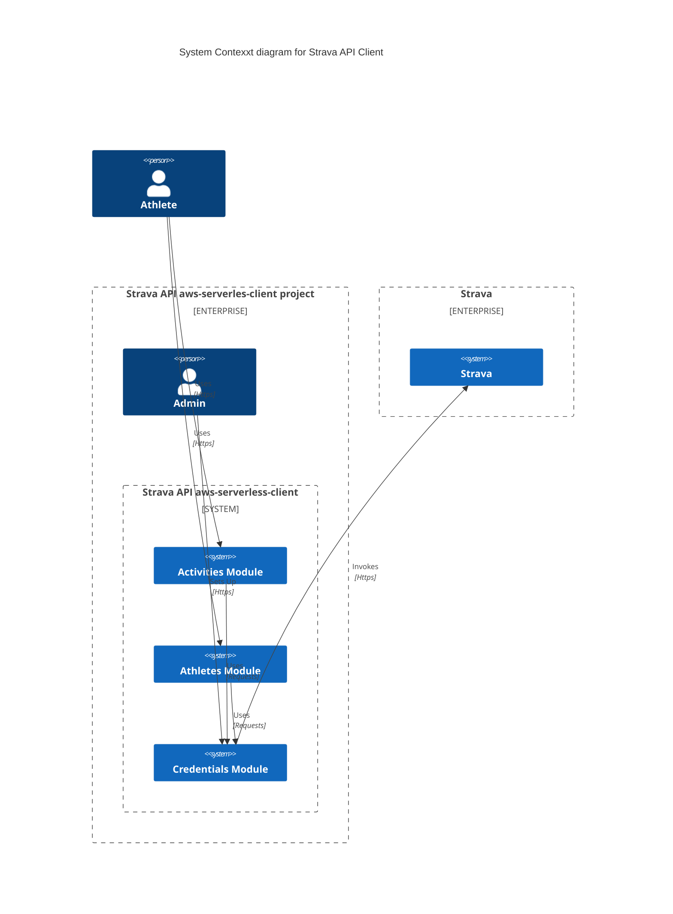
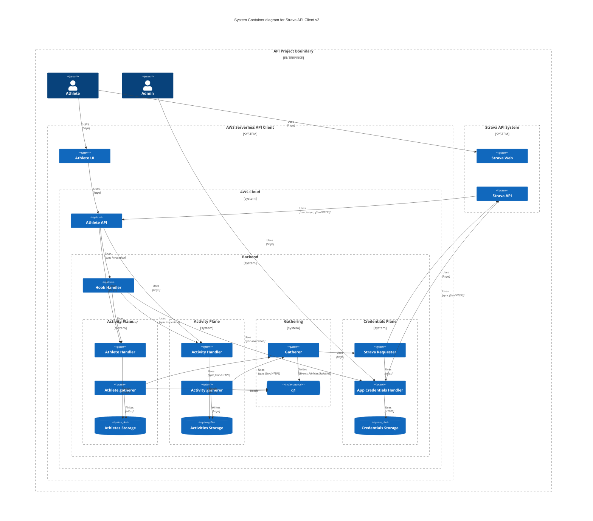

# strava-aws-serveless

## What
Strava API client over aws serverless components

* [Strava API docs](https://developers.strava.com/docs/)

## Why

Test and explore serverless capabilities and show how to securely interact with a third party which authorizes users with OAuth.

## How

In order to create an API client for Strava there are some bootstrapping steps that need to happen first. The most important is registering an app over Strava which will create a set of credentials that will identify said app going forward. Also while doing so, there is need to have a backend to respond to strava in a certain way for authorization and for activities incoming from Strava.

Strava API Values and Credentials must be stored in a secure manner but still made available only to required parts of the system. These vales are a client id, a client secret; also while registering an app the Credentials for current user that is registering the app and they are a pair of tokens one for access with expiration of 6 hours and a refresh token that does not expire. This is slightly confusing as there are credentials for an app and credentials for each authenticated user or Athlete. Meaning there should be pairs of credentials per each user which approves this appliation plus the application itself. Also interesting for this is that every time an access token has expired, it must be refreshed with an api call that will respond with the new access token and a new refresh token.

Also per API Terms applications must implement a web hook that can handle deauthorizations, new activities, changes in visibility of activities and also to avoid hitting rate limits.

## Functionality concept map

Once there is an authenticated app there are muliple ways to query for information but for this integration I'll be using only Athletes and SummaryActivities. Given that the credentials (tokens) for the default user are already provided upon registration we can start some designs in that regards but the design will be made to support multiple Athletes from the start.

Given that the models for Athlete and Activities are different and have different conceptually they are modeled as distinct boundaries but as the interaction with Strava API is mostly the same the similar parts will also be separated to a gatherer boundary that can also interact with credentials boundary and no other part of the system besides the admin should interact with it.

  ## Boundaries

  * [credentials](credentials/README.md). This is the first thing to build as no interaction with Strava API can  happen unless we can identify and authenticate to them. Credentials must not exist outside of this boundary so a component that can enrich requests with appropiate credentials and forward request to Strava API will be held here.
  * Gathering. Once credentials are available, interactions with Strava API can be made to obtain Athletes and Activities. This boundary will not store credentials but will provide information to Credentials boundary to select the appropiate credentials for a given athlete and then make available the retrieved information in a way that any interested part of the system can react to new entries.
  * Athlete Plane. Here information regarding Athletes will be kept, this might have personal information that must not be available to other athletes by Strava API terms and also due to general common practice with Personally Identifiable Data (PII) everywhere in the world.
  * Activity Plane. Here the critical information is geolocalization so only the main statistics will be stored to avoid further problems as this is a Proof of Concept not a full blown product.

  Each of this boundaries will be developed independent of each other to allow evolve independently.

  ## Technology Used

  For these boundaries as stated in the problem statement, Amazon Web Services (AWS) will be the Cloud as a Service provider while the solution will be built with as much as possible with managed services that do not require server or network provisioning. Also in order to be reproducible this will be constructed with Infrastructure as Code using AWS Serverless Application Model (AWS SAM) which in turn is converted to AWS Cloudformation Stacks. These templates should be easy to port to any existing AWS Account thus make this proof of concept reproducible.

  * [AWS Serverless Application Model](https://aws.amazon.com/serverless/sam/)

[License](LICENSE.md)