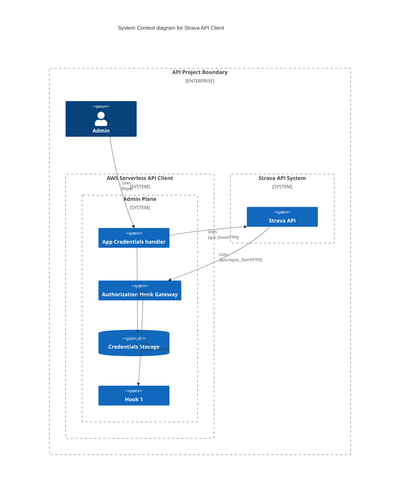
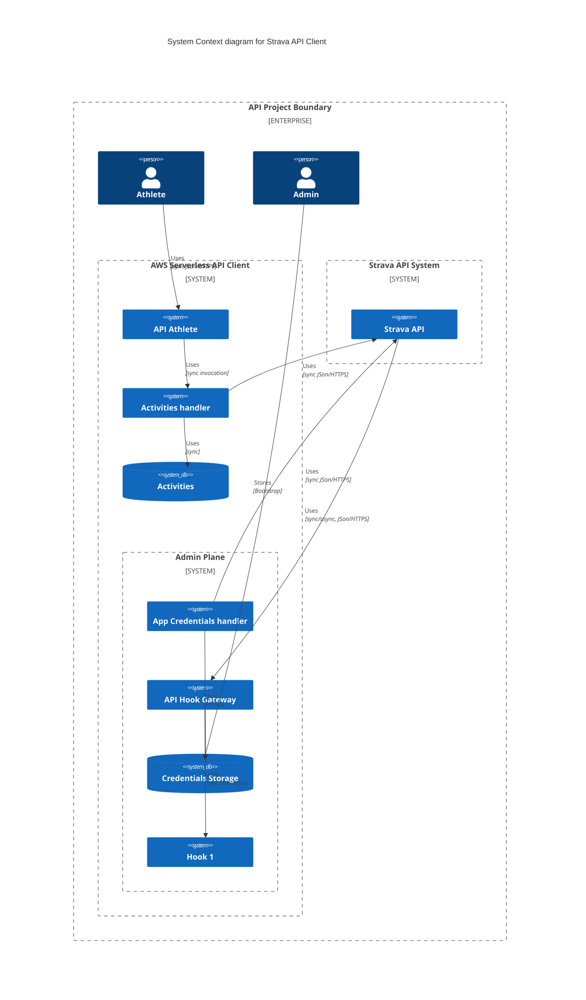

# strava-aws-serveless
Strava API client over aws serverless components

In order to create an API client for Strava there are some bootstrapping steps that need to happen first. The most important is registering an app over Strava which will create a set of credentials that will identify said app going forward. Also while doing so, there is need to have a backend to respond to strava in a certain way.

...

